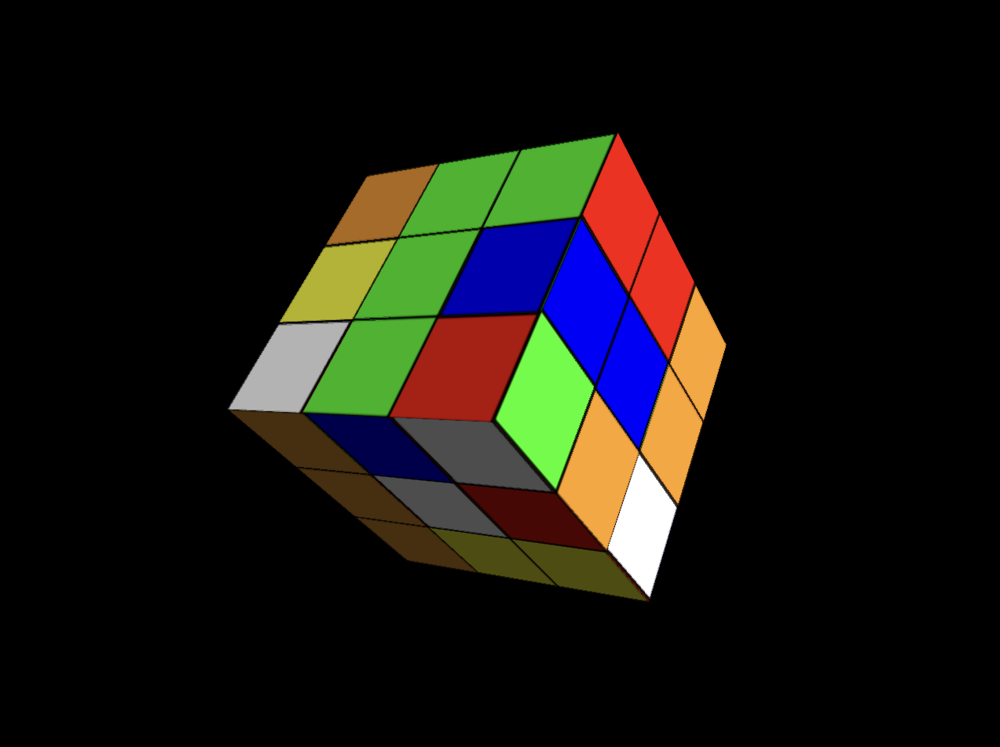
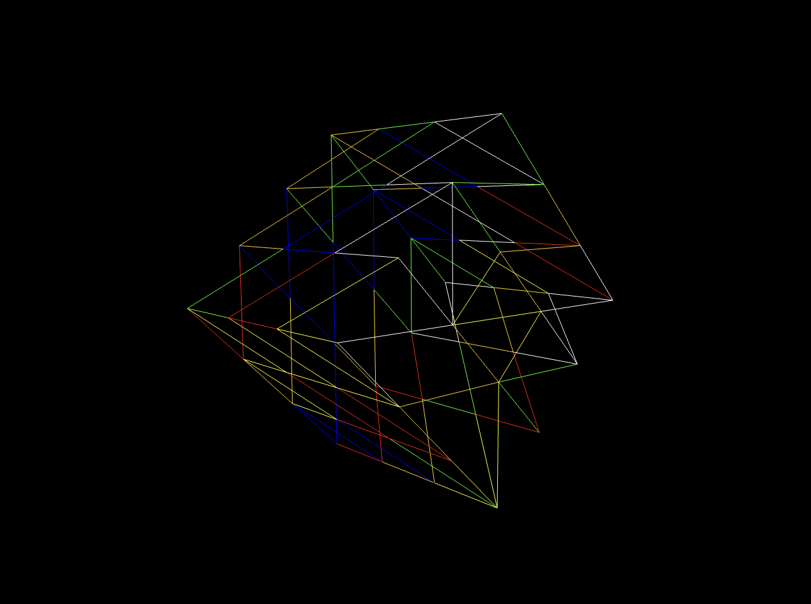
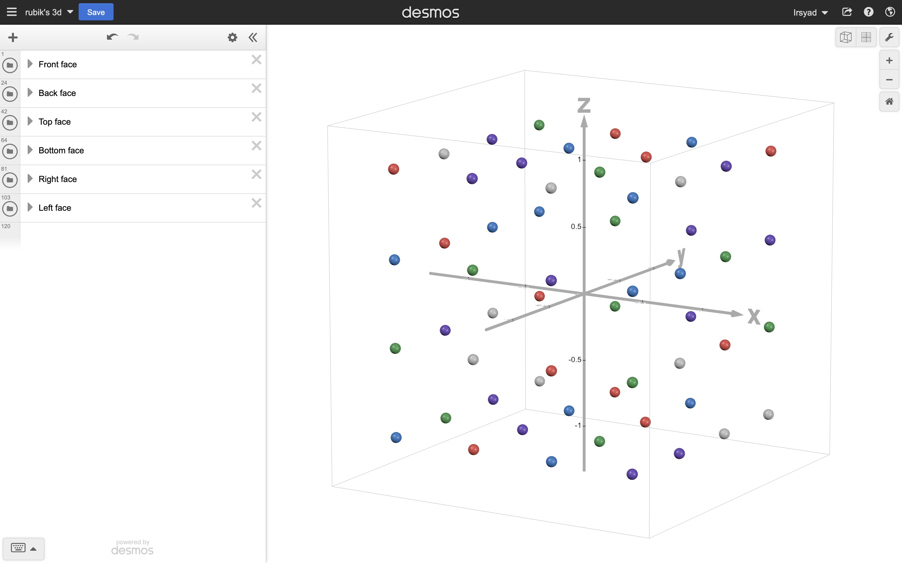

# Grafik Komputer - WebGL

Proyek ini adalah implementasi dasar dari WebGL dengan tujuan menggambar objek 3D, yaitu Rubik’s Cube. Menggunakan WebGL, proyek ini menampilkan Rubik’s Cube yang dirender dalam ruang 3D dengan bantuan buffers untuk posisi, warna, dan indeks.

## Hasil

Contoh hasil render dari Rubik’s Cube dapat dilihat pada gambar berikut:





## Alat Bantu:

- https://www.desmos.com/3d/

## Referensi:

- https://developer.mozilla.org/en-US/docs/Web/API/WebGL_API/Tutorial

## Struktur Proyek:
```sh
src/
├── data-colors.js      # Array warna RGB untuk setiap sisi Rubik's Cube
├── data-indices.js     # Array indeks untuk membentuk TRIANGLES
├── data-positions.js   # Array posisi (x, y, z) untuk setiap titik
├── draw-scene.js       # Fungsi render untuk menggambar objek pada layar
├── index.html          # Halaman HTML utama
├── init-buffers.js     # Inisialisasi buffer (posisi, warna, dan indeks)
└── webgl-demo.js       # Skrip utama untuk menjalankan aplikasi
```

## Penjelasan File:

- `init-buffers.js`: Menginisialisasi buffer posisi, warna, dan indeks yang diperlukan untuk merender objek. Data diambil dari `data-colors.js`, `data-indices.js`, dan `data-positions.js`.

- `data-colors.js`: Berisi array RGB dengan 216 nilai untuk mendefinisikan warna pada setiap sisi Rubik’s Cube, dihitung dari $2 \times 3 \times 2 \times 3 \times 6 = 216$.

- `data-indices.js`: Berisi array indeks yang membentuk segitiga dengan jumlah yang sama, yaitu 216.

- `data-positions.js`: Array yang menyimpan koordinat posisi (x, y, z) untuk setiap titik pada Rubik’s Cube, dengan total 648 nilai (216 titik unik).

    - Semua posisi dihitung dan dituliskan manual menggunakan bantuan kalkulator 3D Desmos untuk memastikan akurasi tata letak 3D.

    

- `draw-scene.js`: File yang menangani proses rendering Rubik’s Cube pada layar.

- `webgl-demo.js`: Skrip utama yang menjalankan seluruh proses dan menginisialisasi elemen-elemen WebGL yang diperlukan.
